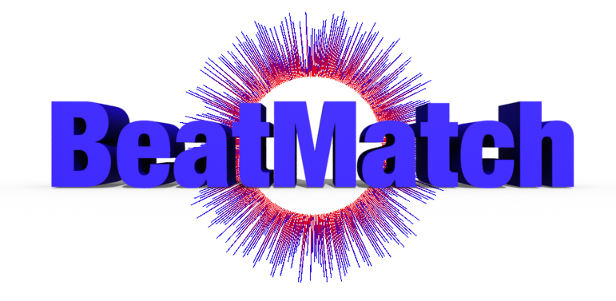

My 2019 WWDC Student Scholarship Submission.

This playground, uses the **Metal**, **Accelerate** and **AVFoundation** frameworks to implement a short and sweet beat matching game with a real time audio visualizer

#### You can see a demo of it on youtube!
https://youtu.be/7e6X7DzddIQ

## License
Please check the license, this **is not for commercial use**

## Tutorials
I'm currently working on making tuturials out of all the things I've learned. Mainly Metal Shaders and signals processing. The list below will be updated as they come :).

1. [Using Swift Playgrounds & Playground Books](https://medium.com/@barbulescualex/using-swift-playgrounds-playground-books-87c2707be2b5)

2. [Making Your First Circle Using Metal Shaders](https://medium.com/@barbulescualex/making-your-first-circle-using-metal-shaders-1e5049ec8505)

